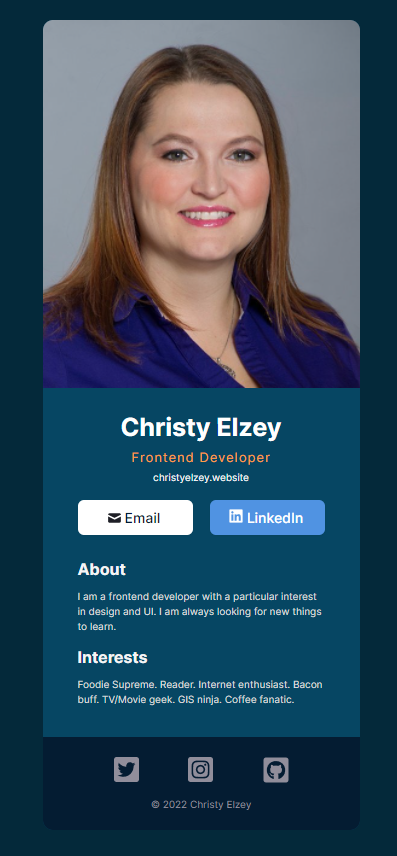

# Scrimba Frontend Developer Career Path - Digital Business Card solo project

This is a solution to the [Scrimba FDCP - Module 11.1 Solo Project: Digital Business Card
](https://www.figma.com/file/4ctPLUvIn5b5Ep6YPOZWWd/Digital-Business-Card?node-id=0%3A1).
Scrimba Solo Projects challenge you improve your coding skills by building realistic projects.

## Table of contents

- [Overview](#overview)
  - [The challenge](#the-challenge)
  - [Screenshots](#screenshots)
  - [Links](#links)
- [My process](#my-process)
  - [Built with](#built-with)
  - [What I learned](#what-i-learned)
- [Author](#author)
- [Acknowledgments](#acknowledgments)

## Overview

### The challenge

Requirements:

- Build from scratch!
- Fill in your own information
- Separate components for:
  - Info (photo, name, buttons, etc.)
  - About
  - Interests
  - Footer (social icons)

### Screenshots

My solution:

### Links

- Solution URL: [GitHub Repository](https://github.com/clelzey/digital-business-card)
- Live Site URL: [GitHub Page](https://clelzey.github.io/digital-business-card/)

## My process

### Built with

- [React](https://reactjs.org/) - JS library

This project was bootstrapped with [Create React App](https://github.com/facebook/create-react-app) and
published to GitHub with [React GitHub Pages](https://github.com/gitname/react-gh-pages).

### What I learned

This is my first project using React. It uses multiple components to render the digital business card.
After finishing the project I realized I hadn't created each of the components that were part of the project.
However, the design was completed. I had a lot of fun adding the glowing hover to my buttons and social icons.

## Author

- Website - [Christy Elzey](https://clelzey.github.io/digital-business-card/)
- GitHub - [@clelzey](https://github.com/clelzey/)
- Twitter - [@codeMuse2](https://twitter.com/codeMuse2)

## Acknowledgments

Thanks to the amazing teachers over at [Scrimba](https://scrimba.com/), their courses have been incredible in teaching
me the skills needed to complete this solo project. The Frontend Developer Career Path has so much content. It is constantly
updated with new challenges and current information. Definitely worth the Pro Membership.

### Supporting Scrimba

Since 2017, we have created over 20 free courses on Scrimba, and we're going to
continue launching free courses. But to pay our bills, we have to charge once
in a while. So if you've ever wanted to "give back" to Scrimba, you can do that by buying
one of our paid courses

- [Become a professional React developer](https://scrimba.com/course/greact)
- [The Responsive Web Design Bootcamp](https://scrimba.com/course/gresponsive)
- [The Ultimate JavaScript Bootcamp](https://scrimba.com/course/gjavascript)

  It would also mean the world to us if you share the courses.

Happy Coding!
